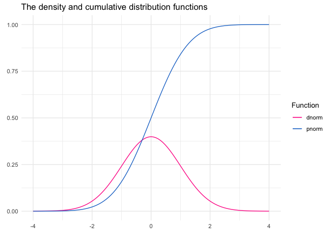
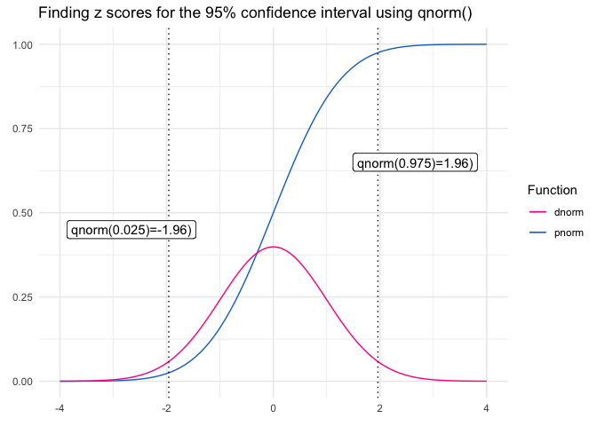

Z distribution in R
================

The Z distribution is the normal distribution with mean equal to 0 and
standard deviation equal to 1.

dnorm() is the density function.  
pnorm() is the cumulative distribution function.  
qnorm() is the quantile function.

<!-- -->

<!-- -->
